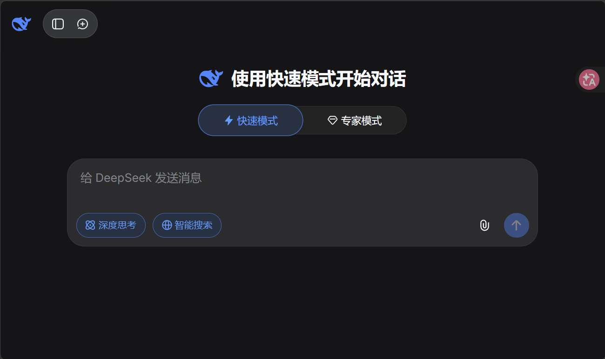
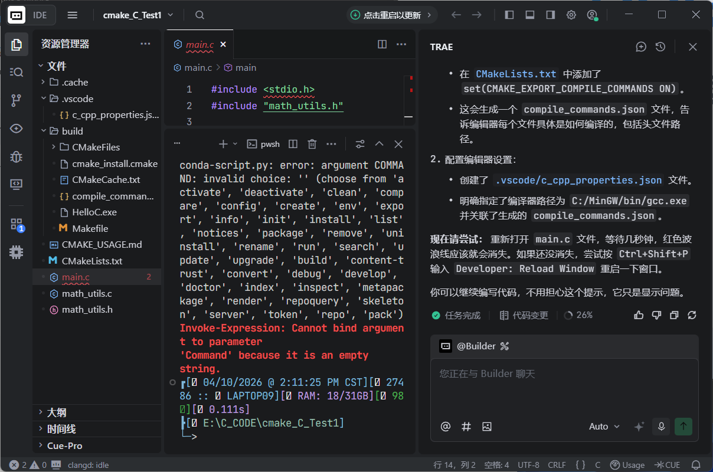
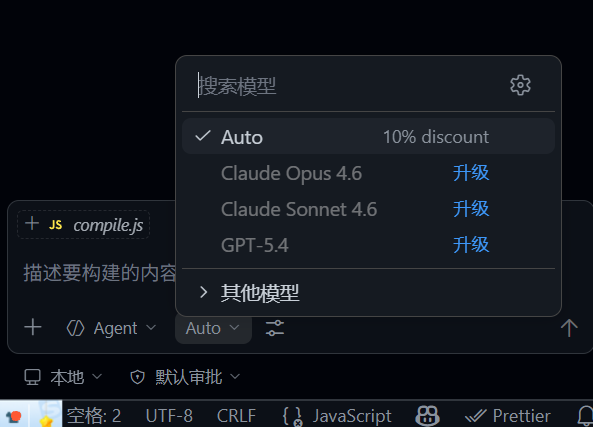
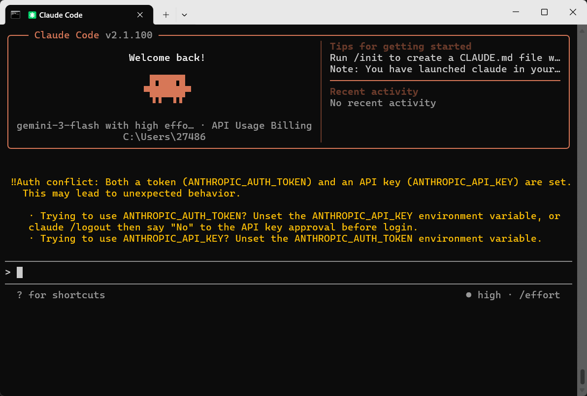
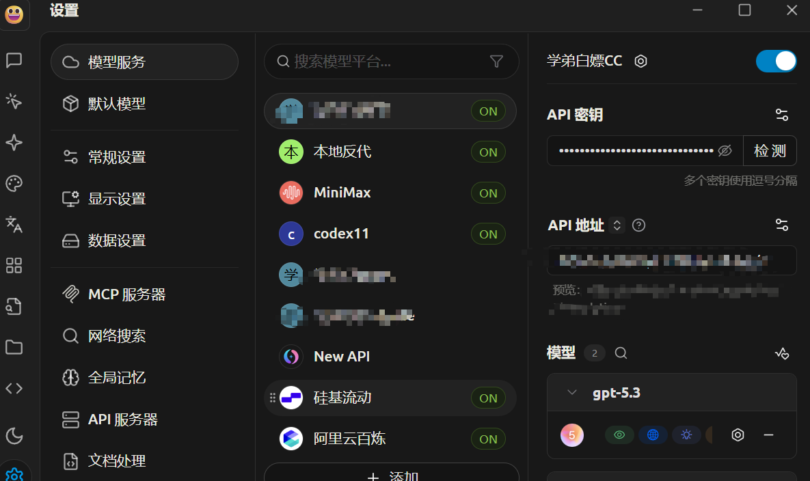
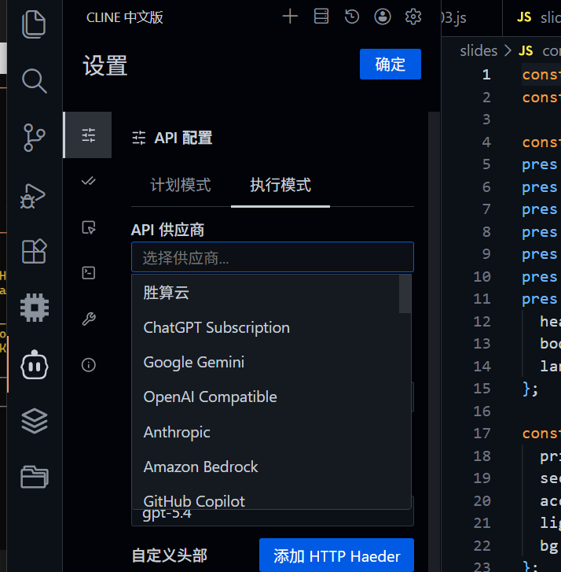

# 什么是api

## 传统web使用界面

可能大家的ai使用可能停留在deepseek的网页时代，在网页的输入框中，很经典，你给出要求他给出回复，仿佛一切使用都离不开浏览器

这种方法是最多人使用的，当然也是最便宜的，大部分都是免费的你不需要花费自己的钱去购买api，只是有时候可能遇到当前高峰期，请稍后等待回答。

## Trea集成模式

可能到这里，有些人在学长或者周围的‘’先驱者‘’的帮助下，接触到了Trea，等集成模式的ai使用，确实很方便，但是额度用完了感觉就废了。类似的还有Vscode中的ai助手

## 命令行CLi模式

到这里你已经接触到了比较高级的东西了，类似的还有Codex之类的。

## api聚合站（cherry studio）

有很多api可以使用，基本上插件里面用自己的api就可以了。

至此就是大部分你可以接触到的，四种ai方式都枚举完了。