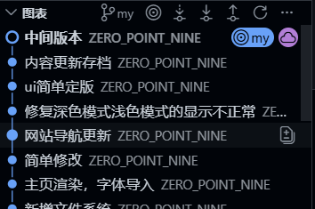
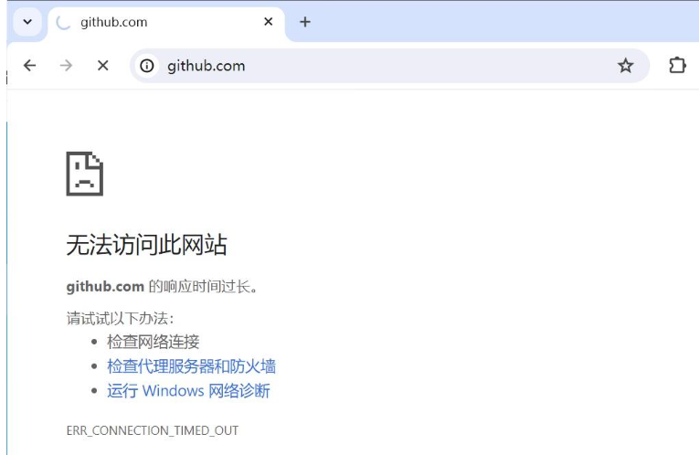
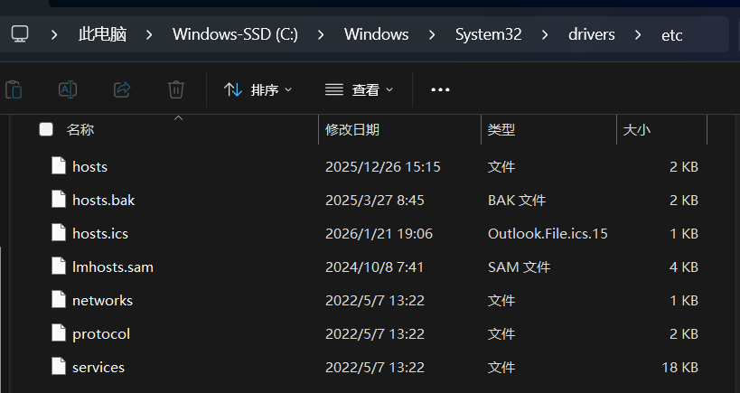
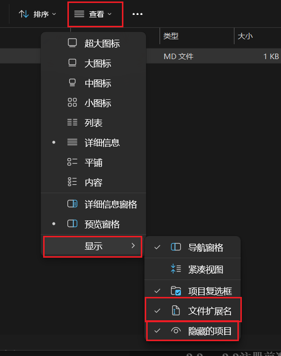
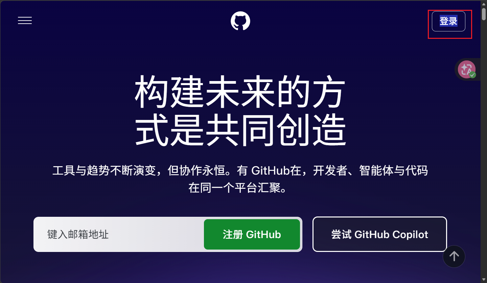
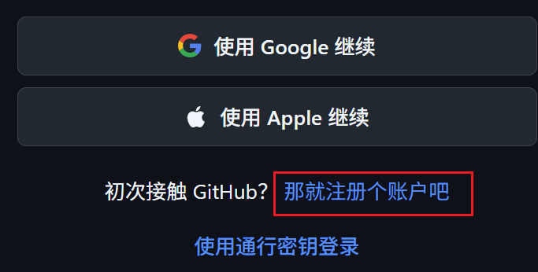
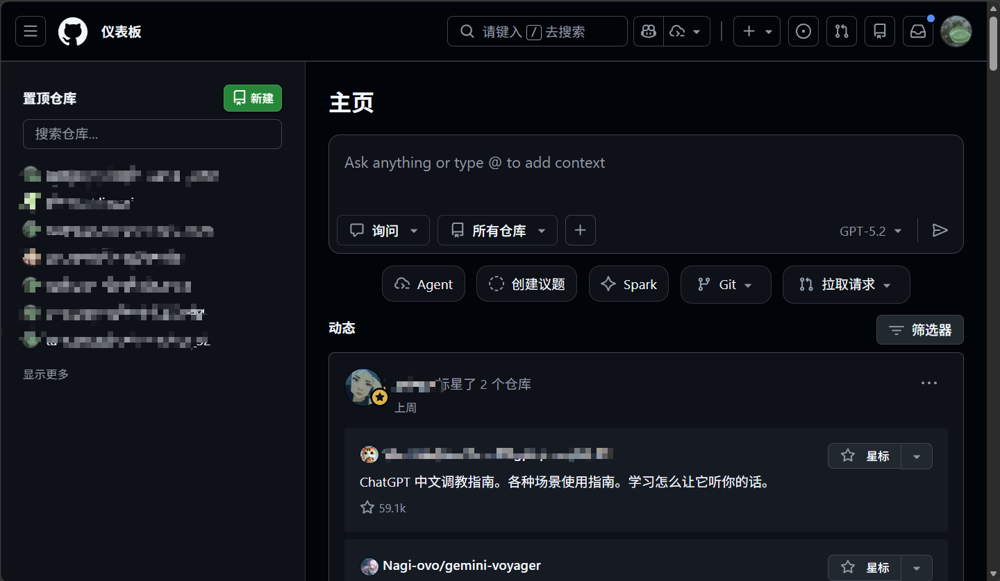
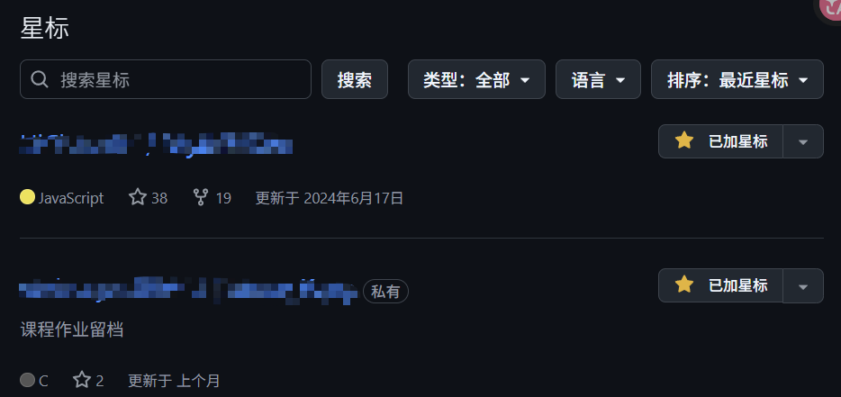
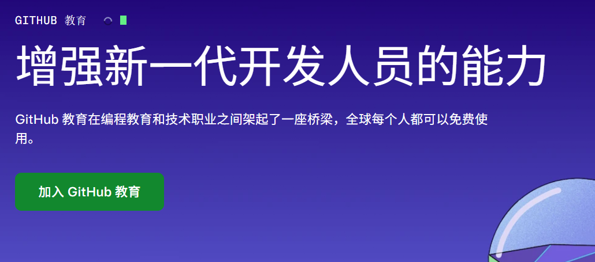

# GitHub入门指南

> GitHub是全球最大的*~~代码托管平台~~*（同性交友平台✓），也是现代程序员必备的工具之一。本文将带你从零开始认识GitHub——在各种大厂都会使用这个仓库，如果你想接触软件，那么这个是你无法避开的平台


## 一、为什么需要GitHub

### 1.1 GitHub是什么

GitHub是目前全球最大的代码托管平台，于2008年正式上线，2018年被微软收购。它基于Git版本控制系统，为开发者提供了代码托管、协作开发、项目管理等一系列功能。

当然你也可以使用国内的类似平台(当然我不推荐)


### 1.2 为什么要使用GitHub

**代码备份与版本控制**

- 云端存储你的代码，再也不用担心硬盘损坏导致代码丢失
- 自动记录每一次修改，随时可以回溯到任意版本
- 支持多人协作，每个人都可以看到项目的完整历史



（类似我的博客开发就是使用了git进行版本管理）

**简历加分项**

- 技术面试中，展示GitHub主页比简历更有说服力
- 活跃的GitHub贡献记录能证明你的技术热情
- 开源项目的参与经历是实力的最佳体现

**展示个人作品**

- 创建个人主页展示你的项目和技能
- 搭建博客、技术文档
- 为开源项目贡献代码，获得认可

github提供了个人网站的博客支持

### 1.3 GitHub能做什么


| 功能 | 说明 |
|------|------|
| 代码托管 | 存储、管理、同步代码 |
| 版本控制 | 追踪修改、版本回溯 |
| 协作开发 | 多人协作、代码审核 |
| Issue追踪 | 任务管理、bug跟踪 |
| Wiki文档 | 项目文档编写 |
| Pages托管 | 搭建个人网站 |
| Actions自动化 | CI/CD、自动化工作流 |
| Packages包管理 | 存储和分发包 |

## 二、注册GitHub账号（怕有些小白真注册都不会就开一篇）

### 首先能够访问github！

（由于国内对ip的限制，大部分地区都是无法直接访问他的，那么如何在合法合规的情况下访问？——有🔮可以跳过这步）


对国内大多数用户，github的访问速度非常慢，甚至是打不开，无法访问。究其原因，多数是GitHub的CDN域名解析（DNS）遭到了污染或拦截。接下来以Windows 10系统为例，通过修改本地hosts文件，解决GitHub无法正常访问的问题。

>参考文章：[ 修改Windows系统hosts文件，解决GitHub国内访问速度慢甚至无法访问的问题 - 知乎](https://zhuanlan.zhihu.com/p/678860499)

#### 大部分人直接访问会遇到的情况



这太正常了，不需要觉得差异，这是祖国对你的保护，接下来开始具体教程。——会比较简略，具体看原文

#### **获取`github.com`的IP地址**

访问以下网址，获取`github.com`域名的相关信息，得到IP地址：`140.82.112.3` 。

> [地址解析网站](https://link.zhihu.com/?target=https%3A//sites.ipaddress.com/github.com/)

#### 修改hosts文件，然后跟着教程就行了



打开这个文件夹路径——大家的电脑都是一样的（大概）

>C:\Windows\System32\drivers\etc

修改其中的host文件，如果你打开发现看不见文件，记得把隐藏文件显示打开，



### 2.2注册前准备

在开始之前，确保你准备好：

- **电子邮箱**：用于账号验证和找回密码，建议使用 Gmail、QQ邮箱或网易邮箱
- **用户名**：将显示在你的主页URL中（如 `github.com/username`），慎重选择
- **密码**：建议使用强密码，至少包含8位字符和数字的组合

### 2.3 注册步骤——我装了汉化插件，但是位置是一样的

**第一步：访问GitHub官网**

打开浏览器，访问 [https://github.com](https://github.com)





**第二步：填写注册信息**

在注册页面填写以下信息：

- **邮箱地址（Email address）**：输入你的邮箱
- **密码（Password）**：设置密码
- **用户名（Username）**：这是你的唯一标识符，会成为你的主页地址

> [!TIP]
>
> 用户名一旦确定很难修改，建议：
>
> - 使用你的网名或真实姓名的拼音
> - 避免使用特殊字符和过长名称
> - 可以考虑带上年份方便区分（如 `zhangsan1999`）

**第三步：验证人机身份**

完成一个简单的人机验证（reCAPTCHA），防止机器人注册。

**第四步：验证邮箱**

GitHub会向你的邮箱发送一封验证邮件，点击邮件中的链接完成验证。

**第五步：完成注册**

验证成功后，你就拥有了GitHub账号，可以开始使用了！

### 2.4 选择计划

注册完成后，GitHub会询问你选择什么计划：

- **免费用户（Free）**：公共仓库无限量，私有仓库有限制
- **付费用户（Pro）**：更多私有仓库、高级功能

对于初学者来说，Free计划已经足够使用。

## 三、GitHub界面介绍

### 3.1 主页布局

登录后的GitHub主页包含以下主要区域：

```
┌─────────────────────────────────────────────────────────┐
│  Logo  Search Bar              +  Notifications  Profile│
├─────────────────────────────────────────────────────────┤
│                                                         │
│  ┌──────────┐  ┌──────────┐  ┌──────────┐  ┌──────────┐ │
│  │ 仓库1    │  │ 仓库2    │  │ 仓库3    │  │ 仓库4    │ │
│  └──────────┘  └──────────┘  └──────────┘  └──────────┘ │
│                                                         │
│  Recent activity                                        │
│  · Commits to xxx                                       │
│  · Pushed to xxx                                        │
│                                                         │
└─────────────────────────────────────────────────────────┘
```



### 3.2 主要功能区域

- **顶部导航栏**：搜索、项目、Issues、Pull requests、探索等
- **左侧边栏**：你的仓库列表、Star的项目、收藏的仓库
- **中间区域**：个人动态、推荐内容
- **用户头像**：账号设置、退出登录

## 四、创建第一个仓库

### 4.1 什么是仓库（Repository）

仓库是用来存储项目文件的文件夹。你可以把它理解为一个独立的"项目空间"，每个仓库可以包含代码、文档、图片等所有项目相关文件。

### 4.2 创建新仓库

**方法一：通过主页创建**

1. 点击页面右上角的 **+** 号，选择 **New repository**
2. 填写仓库信息：
   - **Repository name**：仓库名称（如 `my-first-project`）
   - **Description**：简短描述（可选）
   - **Public/Private**：公开/私有
   - **勾选 Initialize this repository with a README**：建议勾选
3. 点击 **Create repository**


## 五、GitHub常用操作

### 5.1 Star（收藏）

Star类似于社交媒体中的"点赞"，用于标记你感兴趣的项目：

- 点击仓库右上角的 **Star** 按钮
- 之后可以在你的 GitHub 主页看到所有 Star 过的项目
- Star 数量也是衡量项目受欢迎程度的重要指标



### 5.2 Fork（派生）——比如我现在的网站渲染引擎

Fork是将别人的仓库复制一份到你的账号下：

- 点击仓库右上角的 **Fork** 按钮
- 等待片刻，仓库就会出现在你的账号中
- 你可以自由修改 Fork 过来的项目
- 如果想贡献回原项目，可以发起 Pull Request

### 5.3 Watch（关注）

点击仓库右上角的 **Watch** 按钮，你可以：

- 接收该仓库的所有更新通知
- 在GitHub首页的notifications中看到更新内容
- 设置通知偏好（All activity / Participating / None）

### 5.4 搜索功能

GitHub提供了强大的搜索功能：

```bash
# 搜索仓库
in:name keyword         # 仓库名包含keyword
in:description keyword # 描述中包含keyword

# 搜索代码
language:python        # Python语言
stars:>100             # Star数大于100

# 搜索用户
location:China         # 中国用户
followers:>1000         # 粉丝数大于1000
```

## 六、GitHub社交功能

### 6.1 个人主页

点击你的头像或用户名，可以进入个人主页。这里展示：

- 你的头像、用户名、简介
- 仓库列表
- Star 过的项目
- 贡献日历和贡献统计

### 6.2 关注与粉丝

- 你可以关注其他用户
- 你的粉丝可以看到你的公开活动
- 这是一种发现优秀开发者的方式

## 七、Github教育优惠

### 7.1 GitHub Education

作为学生，你可以免费申请 GitHub Education 包：

- **GitHub Pro 免费使用**：解锁更多私有仓库和高级功能
- **JetBrains 全家桶免费**：IntelliJ IDEA、PyCharm 等工具
- **AWS 云服务额度**：免费云资源
- **DigitalOcean 云服务额度**：托管服务优惠


### 7.2 申请条件

- 必须是学生身份
- 需要使用学校邮箱（.edu结尾）或上传学生证
- 等待审核通过



### 7.3 申请方法

1. 访问 [GitHub Education](https://education.github.com/)
2. 点击 **Get Benefits**
3. 使用学校邮箱注册或上传学生证明
4. 填写相关信息并提交申请

## 九、GitHub常用技巧

### 9.1 快捷键

GitHub提供了丰富的快捷键，按 `?` 可以查看所有快捷键：

| 快捷键 | 功能 |
|--------|------|
| `g` + `i` | 进入 Issues 页面 |
| `g` + `p` | 进入 Pull Requests 页面 |
| `g` + `c` | 进入 Code 页面 |
| `t` | 开启文件查找 |
| `l` | 跳转到某一行 |
| `b` | 打开文件.blame视图 |

### 9.2 表情符号

在Issue和PR的评论中可以使用表情符号：

```bash
:+1:    # 👍 赞
:-1:    # 👎 踩
:smile: # 😊 微笑
:rocket: # 🚀 火箭
:bug:   # 🐛 Bug
:fire:  # 🔥 热门
```

### 9.3 GitHub CLI

GitHub CLI 是官方提供的命令行工具，可以不离开终端完成GitHub操作：

```bash
# 安装（Windows使用winget或scoop）
# brew install gh

# 登录
gh auth login

# 创建仓库
gh repo create my-project

# 创建PR
gh pr create

# 查看PR状态
gh pr status
```

## 十、学习资源推荐

### 10.1 官方资源

- [GitHub Guides](https://guides.github.com/)：官方学习指南
- [GitHub Skills](https://skills.github.com/)：交互式学习课程
- [GitHub Documentation](https://docs.github.com/)：完整文档

### 10.2 学习建议

**入门阶段**：

1. 先熟悉GitHub网页界面的基本操作
2. 创建自己的第一个仓库并提交代码
3. 学会使用README美化仓库主页

**进阶阶段**：

1. 学会使用Pull Request参与开源项目
2. 配置SSH Key，熟练使用命令行操作
3. 学习使用GitHub Actions实现自动化

**高级阶段**：

1. 尝试维护自己的开源项目
2. 深入参与开源社区贡献
3. 学习GitHub API，实现自动化工具

## 结语

GitHub不仅是代码托管平台，更是程序员展示自我、学习成长的舞台。从今天开始，创建你的GitHub账号，迈出成为开源社区一员的第一步吧！

记住：**你的GitHub主页就是你在互联网上的第二张简历**。


---

**相关推荐**：

- [Git操作完全指南](./git操作.md)
- [Markdown学习笔记](./markdown学习.md)
- [VSCode插件推荐](../我在用什么系列/Vscode插件推荐.md)
