# 文档查看类

## Xmind

>网站链接：[Xmind 思维导图工具 - 高效整理思路](https://xmind.cn/)

对于我来说我，只是把Xmind当做一个简单的思维导图绘制的软件，各种树状图，课设的思维导图，有了Xmind就可以完美的进行可视化展现，加上又是免费的，所以十分推荐。

## draw.io

>网站链接：[draw.io](https://www.drawio.com/)

draw.io是一个开源项目演变而来的，上面的Xmind和他或许有一些的功能重叠，但是当画比较复杂的流程图，功能包含关系，那么一定就是drawio的天下了。

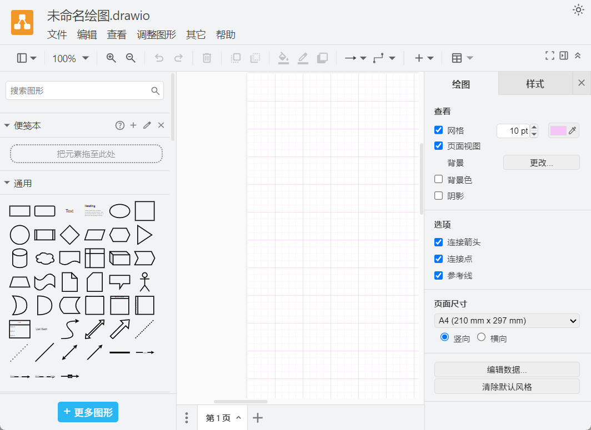

## Typora

>网站链接：[Typora 官方中文站](https://typoraio.cn/)

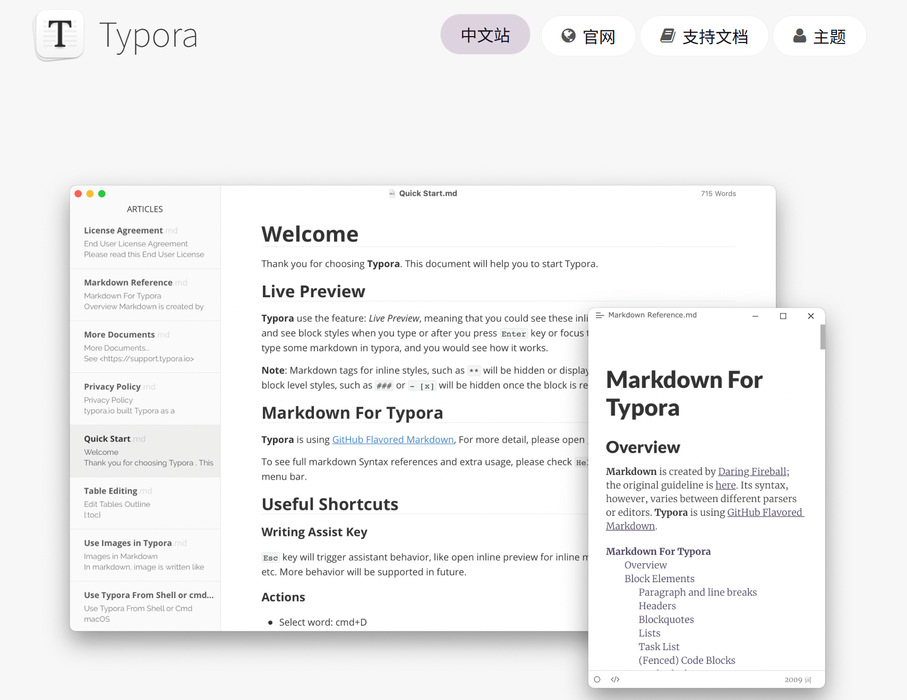

这个软件可以说是接触 markdown 必须要接触的软件，有关 markdown 语言的介绍在另一篇帖子 [【编程语言之 markdown】](../C_编程语言/markdown.md)

Typora 可以对于 Markdown 进行一个即时的渲染，真好用的无敌。而且很美观

### Typora 是什么

Typora 是一款 **支持实时预览的 Markdown 文本编辑器**。它有 OS X、Windows、Linux 三个平台的版本。通过打开 `文件 - 偏好设置` 你会发现 Typora 为编辑体验的考虑细致到了令人叹为观止的程度。Typora 中提供了大量有关 Markdown 偏好的设置，据此，你可以构建一个几乎完全适合自己的 Markdown 编辑器。

### 推荐安装的插件/主题

Typora只是一个简单的框架，一些神级插件才是真正将他捧上王座的原因，有了插件的他，让我基本上没有打开`Word`的欲望了,下面是我自己在用的一些插件。

#### Pandoc——将 md 文件导出为 pdf、word、html 的全能拓展

> 网站链接：[【Pandoc】](https://pandoc.org/)

有了他就能实现课设的导出了。

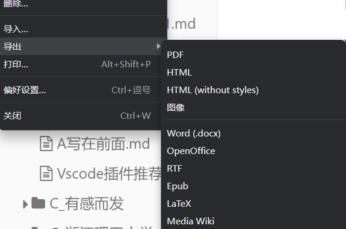

#### Typora_plugin——一个功能丰富的外置插件，所有功能都包含了

> 网站链接：https://github.com/obgnail/typora_plugin

具体的内容可以进他的github主页中进行查看，只能说是相见恨晚。

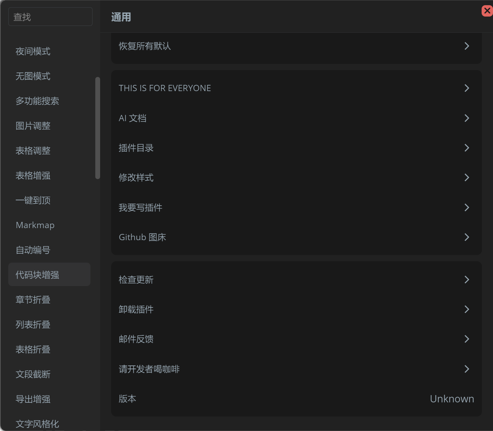

#### Vlook插件

>网站链接：[【简介 - VLOOK™ - 优雅好用的 Typora / Markdown 主题与增强插件】](https://madmaxchow.github.io/VLOOK/)

这个插件主要是提供了一些深入挖掘的CSS主题，有丰富的功能，等待进行探索。

#### Latex主题CSS

>网站链接：[Keldos-Li/typora-latex-theme: 将Typora伪装成LaTeX的中文样式主题](https://github.com/Keldos-Li/typora-latex-theme)

将Typora伪装成LaTeX的中文样式主题，本科生轻量级课程论文撰写的好帮手。加上一开始的导出插件，直接就完成了一篇格式正确的论文，无需考虑排版。

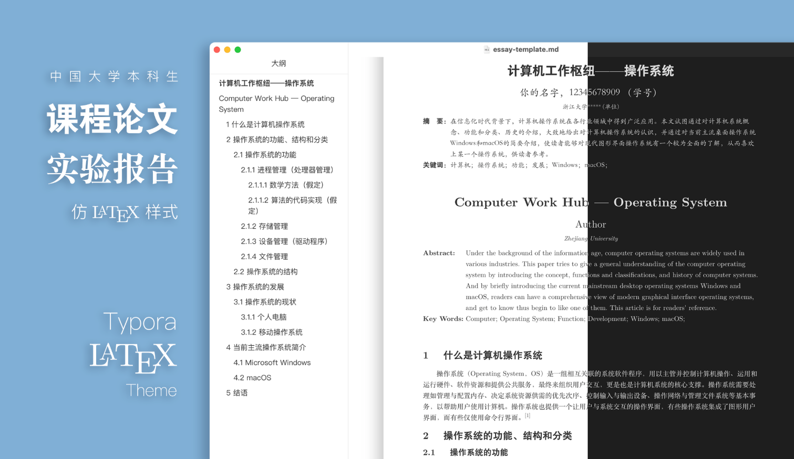

## Zotero

>网站链接：[Zotero | Your personal research assistant](https://www.zotero.org/download/)

Zotero 是一款免费、易于使用的工具，可以帮助您收集、管理、阅读、批注、引用和共享文献。使用 Zotero 将使你的学术生产效率大增。基本上配合浏览器插件，看文章或者收藏网站极其的方便。

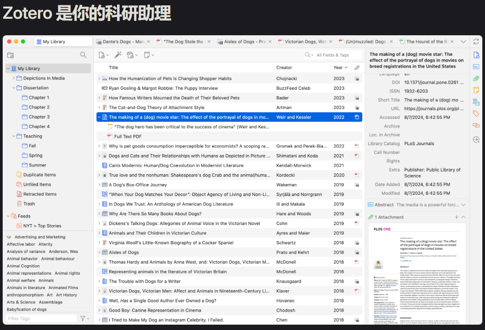

# AI 使用平台

## Cherry Studio

>网站链接：[Cherry Studio 官方网站 - 全能的 AI 助手](https://www.cherry-ai.com/)

好用不必多说，在这个ai百家齐放的时代，如果想同时用多个ai，那么购买他们的api，然后汇聚到一起来使用，一定是最佳的选择了，这个的预置提示词和种种，都能够帮助你提高学习的效率。

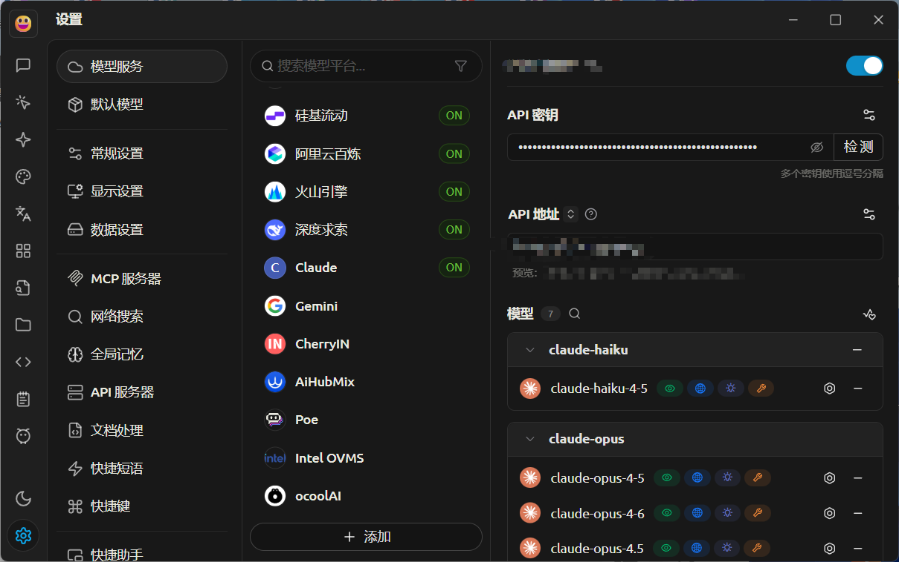

# 代码编写平台

## Vscode
>网站链接：[Visual Studio Code - The open source AI code editor](https://code.visualstudio.com/)

永远无敌的代码编辑器，不要🙅‍♀️再用老师旧的DevC++了，再AI时代一定要接触新的编写平台了。有关我在Vscode中使用的插件，请移步到[【好用Vscode插件推荐】](./Vscode插件推荐.md)

## Powershell7+Oh_Myzsh
>网站链接：[在 Windows 上安装 PowerShell 7](https://learn.microsoft.com/zh-cn/powershell/scripting/install/install-powershell-on-windows?view=powershell-7.6)以及[Oh My Zsh ](https://ohmyz.sh/)

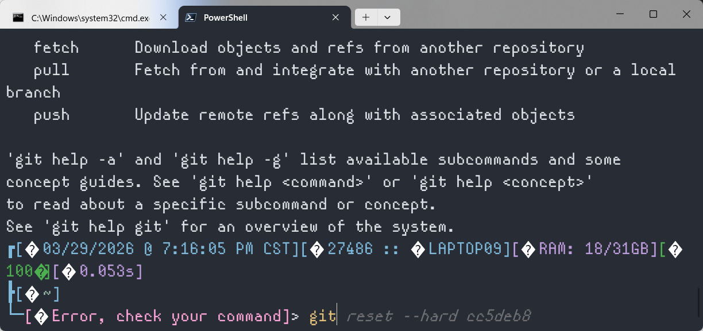

在Oh_My_Zsh的帮助下，我们可以摆脱黑黑的cmd命令栏，并且引入了一些美观的补全。

具体的安装教程可以看下面的：[给 PowerShell 带来 zsh 的体验 - 知乎](https://zhuanlan.zhihu.com/p/137251716)

## GithubDesktop
>网站链接：[Download GitHub Desktop | GitHub Desktop](https://desktop.github.com/download/)

对于不会使用git工具的你，使用githubdesktop无疑是最方便的代码管理方案，建议配套使用汉化包插件。[Github Desktop 汉化工具 ](https://github.com/robotze/GithubDesktopZhTool)如果不知道什么是`git`，那么你可能需要这篇文章，[【git操作】](../B_软件学习路径/一定要学的工具链/git操作.md)

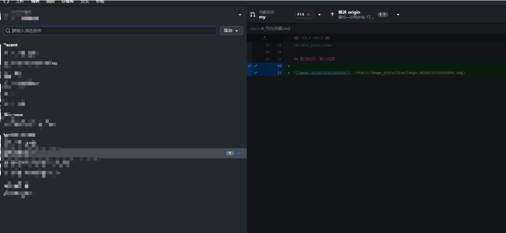

## 省略的部分：Trae和Pycharm

# 电脑美化插件

## 腾讯桌面整理
>网站链接：[桌面整理_桌面整理软件_一键桌面整理工具-腾讯电脑管家官网](https://guanjia.qq.com/product/zmzl/)

## MyDockFinder——steam购入
>网站链接：[MyDockFinder](https://www.mydockfinder.com/)

使用起来真极其丝滑。

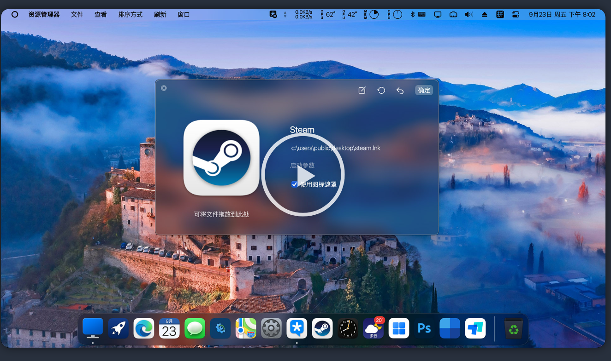

# 实用小工具

## Snipaste

>网站链接：[Snipaste - 截图 + 贴图](https://zh.snipaste.com/)

除了没有文字OCR，其他功能全部爆杀所有截图软件，尤其是置顶功能。

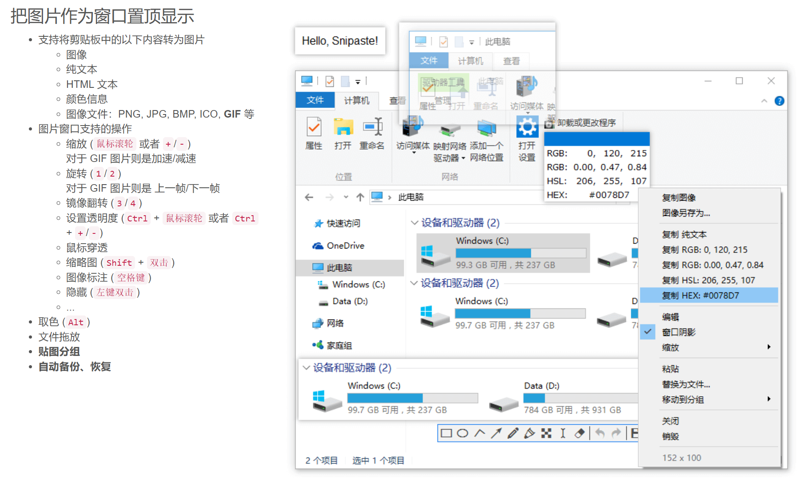

## LocalSend
>网站链接：[LocalSend – 下载](https://localsend.org/zh-CN/download)

好用的局域网快速互传软件，不用再使用微信传输了。

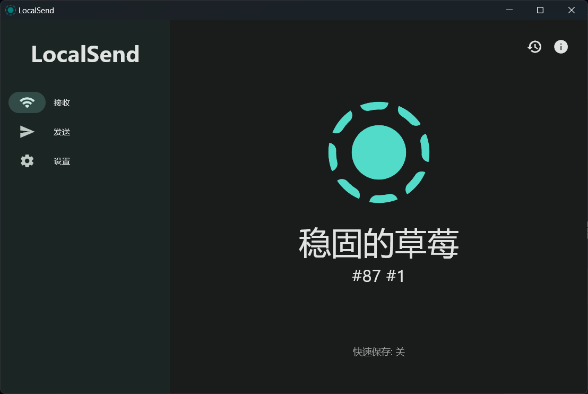

## geek
>网站链接：[Geek Uninstaller - the best FREE uninstaller](https://geekuninstaller.com/)

如果卸载卸不干净的话就使用他吧。一键卸载干净。

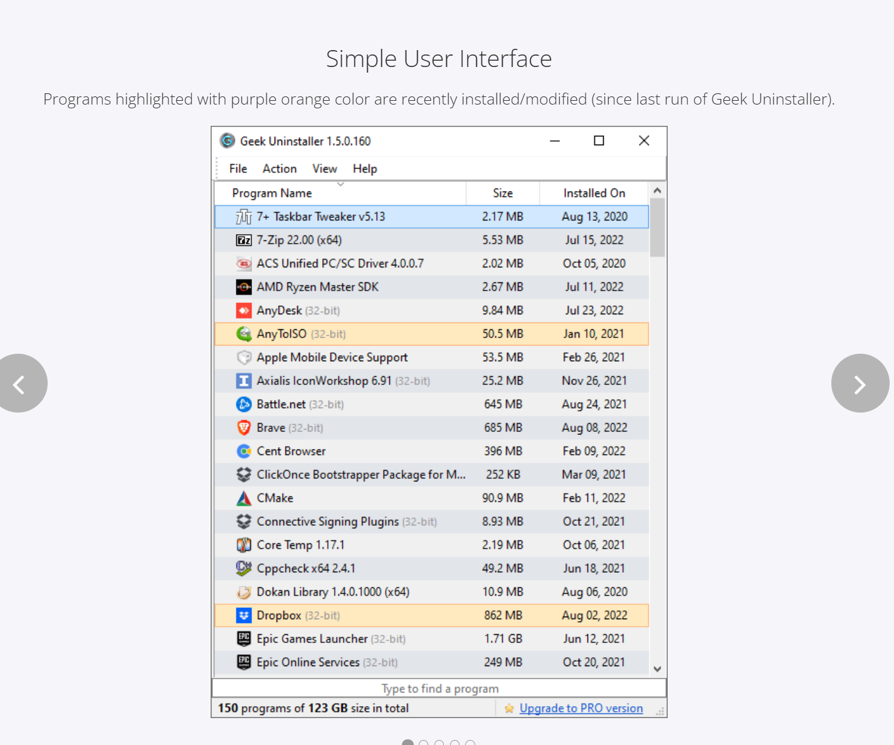