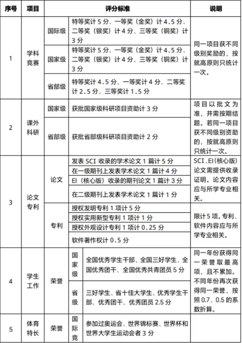
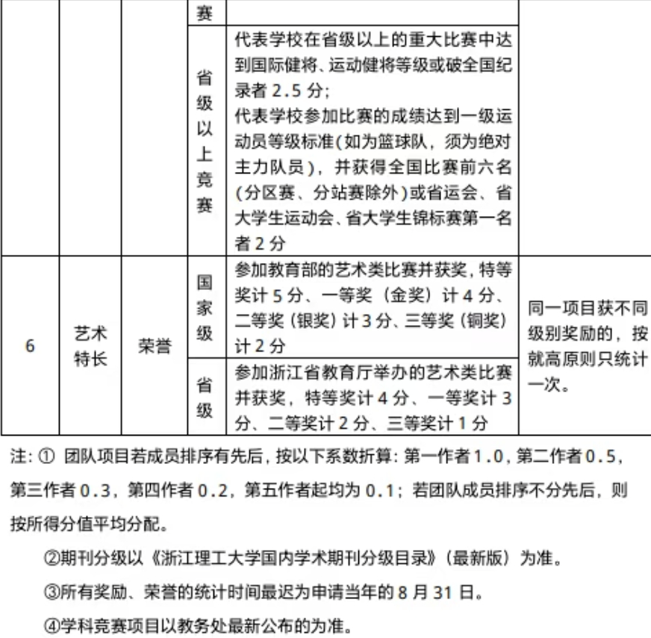

# 怎么看能不能保研

> [!TIP]
>
> 截止至写稿时间2026-04-20
>
> 保研分数构成为80%的纯绩点（课程成绩）+20%的科研分，两者满分都是5分。

特殊情况：

- 挑战杯金奖——队伍第一第二负责人
- 挑战杯银奖——队伍第一负责人

## 加分明细

可以加分的地方有：

## A类学科竞赛才能加分

除数模外，比赛均根据排名进行加分

> 比如电赛省三排名第一:
>
> 1.5/(1+0.5+0.3)*1=?

## 确定时间

你确定有名额的话，大三下的5月就应该开始准备联系老师了，9月中正式确定名额。

## 新苗国创

新苗算省部级

国创算国家级

一般都是两年解题，所以大一填报才有用。

如何寻找————联系自己班主任，或者实验室老师。